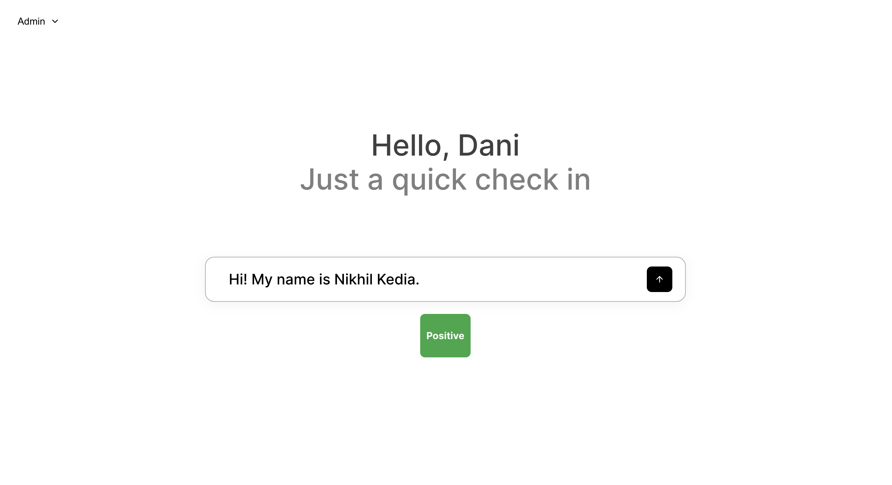

# Cynch AI Text Analyzer

This project is a simple web application built with React and Node.js/Express that serves as a frontend to a mock AI service for analyzing text data. The application allows users to input text and receive a simulated sentiment analysis of the text (positive, neutral, or negative).



## Features

- **User Interface:** Clean and modern UI designed based on Figma mockups.
- **User Dropdown:** A dropdown menu to switch between different users (Admin, User1, User2).
- **Text Input Field:** Allows users to input text for analysis.
- **Sentiment Analysis:** Simulated AI service returns a sentiment result for the input text.
- **Persistent Storage:** Stores the input text and corresponding sentiment results in a JSON file on the server.
- **Live Updates:** The sentiment analysis result is displayed immediately after the user submits the text.

## Technologies Used

- **Frontend:** React, CSS Modules, Feather Icons
- **Backend:** Node.js, Express, File System (fs)
- **Tooling:** npm, curl (for testing API)

## Getting Started

### Prerequisites

Make sure you have Node.js installed on your machine. You can download it from [Node.js](https://nodejs.org/).

### Installation

1. Clone the repository:

   ```bash
   git clone https://github.com/your-username/cynch-ai-text-analyzer.git
   cd cynch-ai-text-analyzer
   ```

2. Install dependencies for the frontend:

   ```bash
   cd cynch-ai-text-analyzer
   npm install
   ```

3. Install dependencies for the backend:

   ```bash
   cd server
   npm install
   ```

### Running the Application

1. **Start the Backend Server:**

   In the `server` directory, run:

   ```bash
   node server.js
   ```

   The server will start on `http://localhost:3001`.

2. **Start the Frontend Development Server:**

   In the `cynch-ai-text-analyzer` directory, run:

   ```bash
   npm start
   ```

   The React app will start on `http://localhost:3000`.

### Usage

1. Open the application in your browser by navigating to `http://localhost:3000`.
2. Enter text in the input field and click the submit button.
3. The application will send the text to the backend, which will return a simulated sentiment analysis result (positive, neutral, or negative).
4. The analysis result will be displayed on the screen.

### Project Structure

```
cynch-ai-text-analyzer/
├── public/               # Public assets
├── src/                  # Source files for React application
│   ├── TextAnalyzer.js   # Main component for text analysis
│   └── TextAnalyzer.module.css # CSS Module for styling
├── server/               # Backend server files
│   ├── server.js         # Express server
│   └── analysisData.json # JSON file to store analysis data
├── README.md             # Project documentation
└── package.json          # npm dependencies and scripts
```

### API Endpoints

- `POST /api/analyze` - Analyzes the input text and returns a sentiment result.

### Troubleshooting

- **`ERR_UNSAFE_PORT` Error:** If you encounter this error, ensure that the backend server is running on a safe port (e.g., 3001).
- **JSON Parsing Errors:** If the server crashes due to a JSON parsing error, check the `analysisData.json` file for corruption and reset it to an empty array (`[]`).

### Future Enhancements

- Implement actual AI-driven sentiment analysis.
- Add user authentication to manage multiple users' data.
- Store analysis data in a database rather than a JSON file.

### License

This project is licensed under the MIT License - see the [LICENSE](LICENSE) file for details.

### Acknowledgments

- [Feather Icons](https://feathericons.com/) for the icon set.
- [React](https://reactjs.org/) and [Node.js](https://nodejs.org/) communities for providing great tools and frameworks.