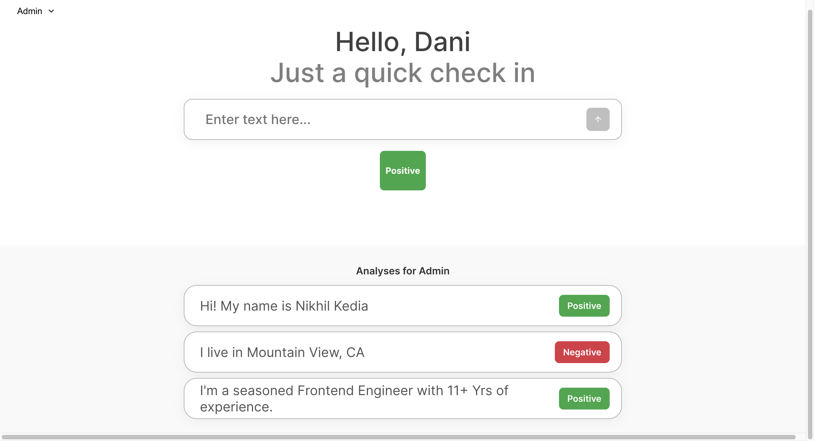

# Text Sentiment Analyzer 📊

A modern, user-friendly web application that performs real-time sentiment analysis on text input. Built with React and Node.js, this application provides an intuitive interface for analyzing text sentiment while maintaining user-specific analysis history.



## 🌟 Features

### Core Functionality

- **Real-time Sentiment Analysis**: Instantly analyze text to determine if it's positive, neutral, or negative
- **User Profile Management**: Switch between different user profiles to maintain separate analysis histories
- **Analysis History**: View and track the last three analyses for each user
- **Persistent Storage**: Analysis results are saved and persisted across sessions

### Technical Features

- **Responsive Design**: Optimized for all devices (desktop, tablet, and mobile)
- **Modern UI/UX**: Clean, intuitive interface with smooth animations
- **Real-time Updates**: Instant feedback on analysis results
- **Error Handling**: Graceful error management and user notifications
- **Performance Optimized**: Built with React best practices for optimal performance

## 🚀 Quick Start

### Prerequisites

- Node.js (v14.0.0 or higher)
- npm (v6.0.0 or higher)
- Modern web browser (Chrome, Firefox, Safari, or Edge)

### Installation

1. **Clone the repository**

   ```bash
   git clone https://github.com/yourusername/text-sentiment-analyzer.git
   cd text-sentiment-analyzer
   ```

2. **Install dependencies**

   ```bash
   # Install frontend dependencies
   npm install

   # Install backend dependencies
   cd server
   npm install
   cd ..
   ```

3. **Environment Setup**

   ```bash
   # Create a .env file in the root directory
   touch .env

   # Add the following environment variables
   PORT=3000
   SERVER_PORT=3002
   ```

4. **Start the application**

   ```bash
   # Start both frontend and backend (in development mode)
   npm run dev

   # Or start them separately:
   # Terminal 1 - Frontend
   npm start

   # Terminal 2 - Backend
   npm run server
   ```

The application will be available at:

- Frontend: http://localhost:3000
- Backend API: http://localhost:3002

## 📖 Usage Guide

1. **Select a User Profile**

   - Click the user dropdown in the top-right corner
   - Choose from available user profiles or create a new one

2. **Analyze Text**

   - Enter or paste your text in the input field
   - Click "Analyze" or press Enter
   - View the sentiment result and confidence score

3. **View History**
   - Recent analyses appear below the input field
   - Each entry shows the text, sentiment, and timestamp
   - Click on any history item to re-analyze

## 🏗️ Project Structure

```
text-sentiment-analyzer/
├── public/                     # Static assets and index.html
├── src/                        # Frontend source code
│   ├── components/            # React components
│   │   ├── Header/           # Application header
│   │   │   ├── Header.tsx
│   │   │   └── Header.module.css
│   │   ├── InputField/       # Text input component
│   │   │   ├── InputField.tsx
│   │   │   └── InputField.module.css
│   │   ├── ResultDisplay/    # Analysis results display
│   │   │   ├── ResultDisplay.tsx
│   │   │   └── ResultDisplay.module.css
│   │   ├── UserAnalyses/     # User history component
│   │   │   ├── UserAnalyses.tsx
│   │   │   └── UserAnalyses.module.css
│   │   └── UserDropdown/     # User selection component
│   │       ├── UserDropdown.tsx
│   │       └── UserDropdown.module.css
│   ├── hooks/                # Custom React hooks
│   │   └── useTextAnalyzer.ts
│   ├── types/                # TypeScript type definitions
│   │   ├── analysis.types.ts
│   │   └── user.types.ts
│   ├── utils/                # Utility functions
│   │   └── api.ts
│   ├── styles/               # Global styles
│   │   └── global.css
│   ├── App.tsx              # Main application component
│   └── index.tsx            # Application entry point
├── server/                    # Backend server
│   ├── routes/               # API route handlers
│   │   └── analysis.routes.ts
│   ├── middleware/           # Custom middleware
│   │   └── error.middleware.ts
│   ├── types/                # Server type definitions
│   │   └── server.types.ts
│   ├── utils/                # Server utilities
│   │   └── analysis.utils.ts
│   └── server.ts             # Express server setup
├── tests/                    # Test files
│   ├── components/           # Component tests
│   └── utils/                # Utility tests
├── tsconfig.json            # TypeScript configuration
├── package.json             # Project metadata and dependencies
└── .gitignore              # Git ignore rules
```

## 🛠️ Development

### TypeScript Configuration

The project uses TypeScript for both frontend and backend development. Key TypeScript features include:

- Strict type checking enabled
- Modern ES6+ features
- React with TypeScript support
- Path aliases for cleaner imports
- Separate configurations for frontend and backend

### Available Scripts

```bash
# Start development servers
npm run dev

# Type checking
npm run type-check

# Run tests
npm test

# Build for production
npm run build

# Start production server
npm run start:prod

# Lint code
npm run lint

# Format code
npm run format
```

### Code Style

- Follow the included ESLint and TypeScript configuration
- Use Prettier for code formatting
- Write meaningful commit messages
- Include tests for new features
- Use proper TypeScript types and interfaces
- Follow React TypeScript best practices

## 🤝 Contributing

1. Fork the repository
2. Create a feature branch (`git checkout -b feature/AmazingFeature`)
3. Commit your changes (`git commit -m 'Add some AmazingFeature'`)
4. Push to the branch (`git push origin feature/AmazingFeature`)
5. Open a Pull Request

Please read [CONTRIBUTING.md](CONTRIBUTING.md) for details on our code of conduct and the process for submitting pull requests.

## 🐛 Troubleshooting

### Common Issues

1. **Port already in use**

   ```bash
   # Find process using port 3000
   lsof -i :3000
   # Kill the process
   kill -9 <PID>
   ```

2. **Dependencies issues**

   ```bash
   # Clear npm cache
   npm cache clean --force
   # Remove node_modules and reinstall
   rm -rf node_modules
   npm install
   ```

3. **Backend connection errors**
   - Ensure the backend server is running
   - Check if the correct port is set in .env
   - Verify network connectivity

## 🔮 Future Improvements

- [ ] Implement real sentiment analysis using NLP APIs
- [ ] Add user authentication and authorization
- [ ] Integrate with a proper database (MongoDB/PostgreSQL)
- [ ] Add support for batch text analysis
- [ ] Implement export functionality for analysis history
- [ ] Add dark mode support
- [ ] Create a mobile app version
- [ ] Add support for multiple languages

## 📝 License

This project is licensed under the MIT License - see the [LICENSE](LICENSE) file for details.

## 👥 Authors

- Your Name - Initial work - [YourGitHub](https://github.com/yourusername)

## 🙏 Acknowledgments

- React.js team for the amazing framework
- Express.js for the backend framework
- All contributors who have helped shape this project

---

⭐ Star this project if you find it useful!
